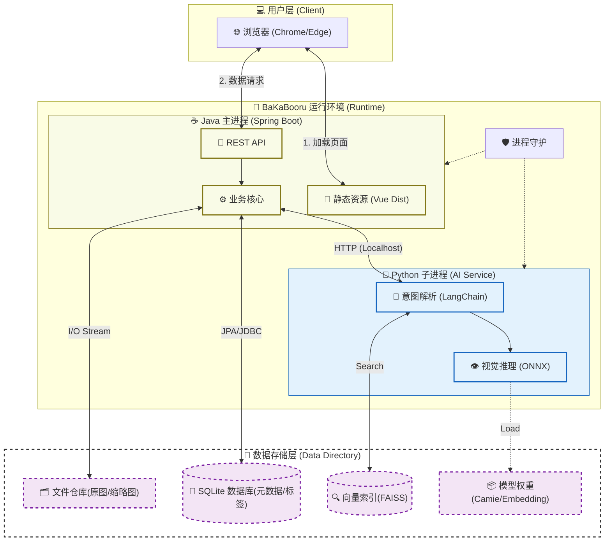

# BaKaBooru: AI-Powered Smart Local Image Management System


**BaKaBooru** 是一款 **AI 驱动的智能本地图片管理系统**。

它通过深度集成 **计算机视觉 (Computer Vision)** 与 **大语言模型 (LLM)**，将传统的“人工整理”转变为“AI 自动化托管”。BaKaBooru 能够赋予你的本地图库“视觉”与“大脑”——自动识别画面内容、构建语义索引，并利用 **RAG (检索增强生成)** 技术理解你的自然语言指令，为你提供 **零隐私风险、离线可用** 的下一代资产管理体验。

---

## ✨ 核心特性 (Key Features)

### 1. 多模态混合检索系统

支持多种维度的搜索方式，满足不同场景下的查找需求：

* **自然语言语义搜索 (AI)**：通过 **LLM** 解析意图并结合 **文本嵌入模型 (Text Embedding)** 进行向量召回。支持复杂的自然语言描述（如
  *"找一些蓝色背景的侧脸特写"*）。
* **标签精确搜索**：基于 Danbooru 标签体系的精确匹配，支持 **正向标签 (Positive)** 与 **负向排除 (Negative)** 组合查询。
* **元数据检索**：支持按 **文件名** 和 **图片标题** 进行关键词模糊搜索。
* **智能排序**：搜索结果支持自定义排序，包括：**文件大小**、**上传时间**、**查看次数** (热度) 等。

### 2. 智能化资产管理

* **批量导入与去重**：支持文件夹拖拽批量上传。内置 **Hash (SHA-256) 计算引擎**，在导入时自动检测并拦截重复图片，节省存储空间。
* **AI 自动标注**：集成 **Camais03/camie-tagger-v2-app** 模型，上传即自动生成高精度标签（角色、画师、风格）。
* **下载与归档**：提供原图下载功能，方便素材提取与二次分发。

### 3. 高性能视觉体验

* **自适应缩略图引擎**：列表页加载经过预处理的 **缩放预览图**，而非原图，显著提升加载速度与浏览流畅度。
* **个性化视图**：用户可自由调节缩略图尺寸（大图/紧凑模式），适应不同分辨率屏幕。
* **虚拟滚动 (Virtual Scroll)**：轻松承载 10W+ 级别图片浏览，内存占用极低。

### 4. 安全与访问控制

* **JWT 身份认证**：内置基于 **JSON Web Token** 的安全登录系统。
* **访问保护**：支持设置访问密码，保护个人隐私库，防止未授权访问。

---

## 🧠 技术实现细节 (Technical Details)

### AI 标签生成与推理

* **视觉模型**：采用 **Camais03/camie-tagger-v2-app** 模型进行端侧推理，无需联网即可精确识别图片内容。
* **执行环境**：基于 ONNX Runtime，支持 CPU/GPU 加速。

### RAG 检索流程

当用户输入自然语言时，系统执行以下流水线：

1. **意图解析**：LLM 分析用户语句，分离出“描述性需求”与“排除性需求”。
2. **向量召回**：使用文本嵌入模型将描述转化为向量，在 FAISS 向量库中计算余弦相似度，召回最匹配的标准标签。
3. **结构化查询**：将召回的标签转化为数据库查询语句，执行最终检索。

---

## 🏗️ 系统架构 (Architecture)

BaKaBooru 采用 **Java (Host) + Python (AI Sidecar)** 双进程架构，前端资源打包于 Java 进程中，数据与程序逻辑物理分离。



---

## 🚀 快速开始 (Getting Started)

### 运行环境

* **OS**: Windows 10/11 (x64)
* **依赖**: 发布包已内置独立运行环境，**开箱即用**。

### 启动步骤

1. 下载最新 Release 包并解压。
2. 双击运行根目录下的 `bakabooru.exe`。
3. 首次启动会自动初始化 `data/` 目录并下载 AI 模型文件。
4. 访问 `http://localhost:8080`，默认无需密码（可在设置中开启登录保护）。

### 命令行参数 (CLI Arguments)

适用于高级用户或服务器部署场景。

| 参数           | 默认值      | 描述          |
|:-------------|:---------|:------------|
| `--web-port` | `8080`   | Web 服务访问端口  |
| `--ai-port`  | `8081`   | 内部 AI 微服务端口 |
| `--data-dir` | `./data` | 数据存储路径重定向   |

---

## 🛠️ 开发指南 (Development)

### 前置要求

* **Java**: JDK 21+
* **Python**: 3.10+
* **Node.js**: LTS Version

### 模块构建

#### 1. 后端 (Spring Boot)

```bash
cd backend
mvn spring-boot:run
```

#### 2. 前端 (Vue 3 + Vite)

```bash
cd frontend
pnpm install && pnpm dev
```

#### 3. AI 服务 (FastAPI)

```bash
cd tagger
pip install -r requirements.txt
# 启动时会自动处理模型加载
python run_app.py --data_dir ../data
```

---

## 📄 开源协议

本项目基于 MIT 许可证开源。