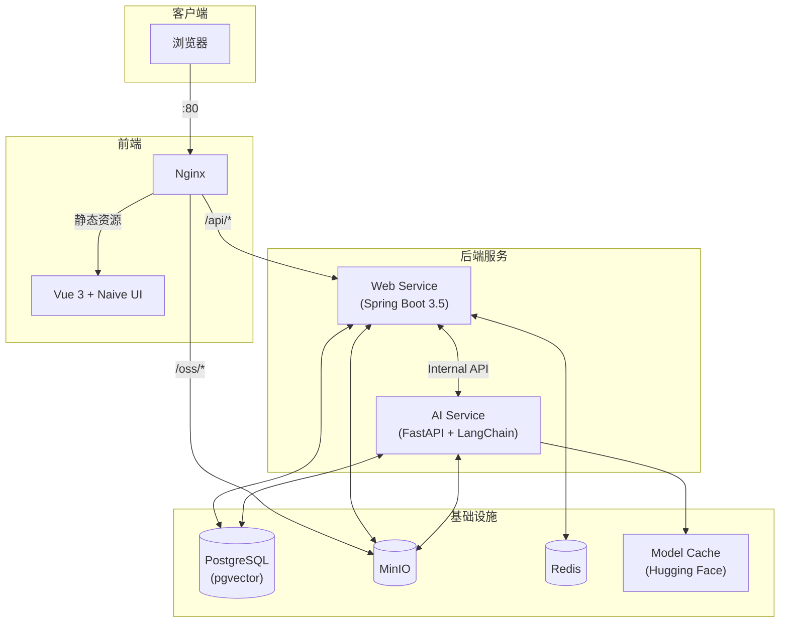

# BaKaBooru


一个支持 AI 辅助标注和语义搜索的本地图库管理系统。

---

## ✨ 核心功能

### 多模态搜索

集成 CLIP 模型与 LangChain 框架，支持多种搜索方式：

- **语义搜索**：输入自然语言描述，通过 LLM 解析意图并转换为 CLIP 向量进行图像相似度匹配，同时使用 all-MiniLM-L6-v2 进行标签向量召回
- **标签搜索**：基于 Danbooru 标签体系的精确查询
- **属性过滤**：按文件名、标题、分辨率、文件大小等元数据筛选

### 自动标注

- 图片上传后自动进入后台队列
- 使用 Camie-Tagger v2 模型自动识别并打标签（角色、画师、风格等）
- 内置哈希去重

### 离线运行

- 所有 AI 模型（Tagger, CLIP）基于 Hugging Face
- 首次启动自动下载模型至本地 `data/model_cache`，后续可完全离线使用

---

## 🏗️ 系统架构



---

## 🚀 快速开始

### 前置要求

- **Docker & Docker Compose**

### 配置

复制环境变量模板：

```bash
# Windows (PowerShell)
Copy-Item .env.template .env

# Linux / macOS
cp .env.template .env
```

### 启动服务

#### 方式 A：一键部署（推荐）

```bash
docker-compose up -d
```

- 首次启动会自动下载 AI 模型（约需几分钟）
- 访问 `http://localhost` 即可使用

#### 方式 B：开发模式

仅启动基础设施，业务代码本地运行：

```bash
# 1. 启动基础设施
docker-compose up -d db minio redis minio-createbuckets

# 2. Web Service (Java)
cd backend/web_service
./mvnw spring-boot:run

# 3. AI Service (Python)
cd backend/ai_service
pip install -r requirements.txt
uvicorn app.main:app --reload

# 4. Frontend
cd frontend
pnpm install && pnpm dev
```

开发模式访问 `http://localhost:5173`

---

## 🛠️ 配置说明

- 所有配置通过根目录 `.env` 文件管理
- AI 模型首次下载后存储在 `data/model_cache`，支持离线运行

---

## 📄 开源协议

MIT License
