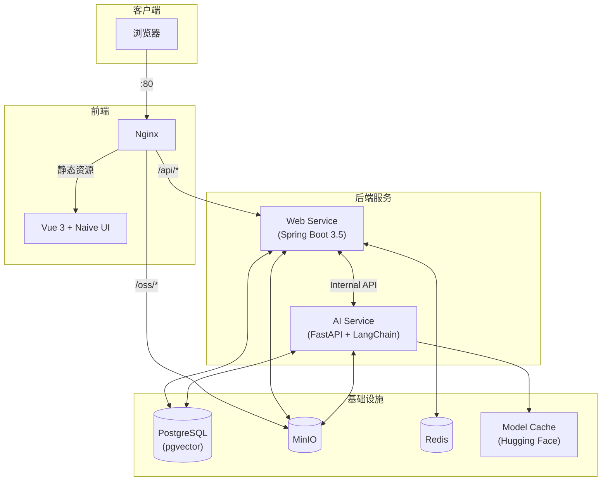

# BaKaBooru


一个支持 AI 辅助标注和基于 RAG (检索增强生成) 语义搜索的本地图库管理系统。

---

## ✨ 核心功能

### 🔍 多模态 RAG 搜索

基于 CLIP 模型与 LangChain 框架，打造下一代搜图体验：

- **以图搜图**：基于 CLIP 视觉特征向量，实现高精度图像相似度匹配。
- **语义搜索（RAG）**：支持自然语言描述，自动通过 LLM 提取标签并结合向量检索，实现“意图->视觉”的精准跨模态搜索。
- **混合检索**：融合向量相似度、标签精确匹配与元数据过滤，召回率与准确率兼备。
- **高级过滤**：支持按分辨率、文件大小、宽高比等元数据进行多维度筛选。

### 🤖 智能化流程

全自动化的 AI 处理管线，无需人工干预：

- **自动标注**：集成 Camie-Tagger v2，支持 70,000+ 标签识别，覆盖动漫与通用场景，准确率高。
- **去重系统**：采用 SHA-256 算法，上传时自动检测并拦截重复图片。
- **智能预处理**：自动提取 Exif/元数据，生成高质量缩略图，优化浏览体验。

### ⚡ 高性能架构

专为大规模图库设计，稳健可靠：

- **技术栈**：Java 21 (Spring Boot 3.5) + Python 3.12 (FastAPI) + Vue 3。
- **数据存储**：PostgreSQL (pgvector) 存向量，MinIO 存文件，Redis 做缓存。
- **安全可靠**：JWT 无状态认证，Flyway 数据库版本控制。

### 🎨 极致体验

- **流畅浏览**：虚拟滚动 + 瀑布流布局，轻松承载万级图片列表。
- **交互优化**：支持批量/拖拽上传，实时进度反馈，TanStack Query 智能缓存。
- **深色模式**：精心调优的 UI，适应各种光照环境。

### 🔒 离线与隐私

- **本地优先**：Tagger 与 CLIP 模型完全本地运行，通过 `.env` 配置一键管理。
- **混合部署**：语义搜索默认使用在线 LLM (推荐 DeepSeek V3.2)，也可对接本地 LLM 实现 100% 离线运行，数据完全掌控。

---

## 🏗️ 系统架构



---

## 🚀 快速开始

### 前置要求

- **Docker & Docker Compose**

### 配置

复制环境变量模板：

```bash
# Windows (PowerShell)
Copy-Item .env.template .env

# Linux / macOS
cp .env.template .env
```

### 启动服务

#### 方式 A：一键部署（推荐）

```bash
docker-compose up -d
```

- 首次启动会自动下载 AI 模型并计算标签向量（约需几分钟）
- 访问 `http://localhost` 即可使用

#### 方式 B：开发模式

仅启动基础设施，业务代码本地运行：

```bash
# 1. 启动基础设施
docker-compose up -d db minio redis minio-createbuckets

# 2. Web Service (Java)
cd backend/web_service
./mvnw spring-boot:run

# 3. AI Service (Python)
cd backend/ai_service
pip install -r requirements.txt
uvicorn app.main:app --reload

# 4. Frontend
cd frontend
pnpm install && pnpm dev
```

开发模式访问 `http://localhost:5173`

---

## 🛠️ 配置说明

- 所有配置通过根目录 `.env` 文件管理
- AI 模型首次下载后存储在 `data/model_cache`，支持离线运行

---

## 📄 开源协议

MIT License
