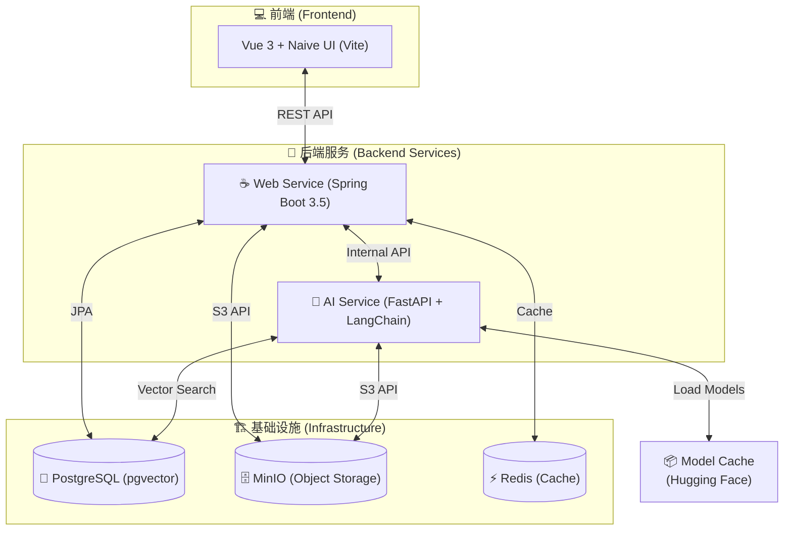

# BaKaBooru: AI-Powered Smart Local Image Management System


**BaKaBooru** 是一款 **AI 驱动的智能本地图库管理系统**。

它的核心目标是为您打造一个“有思想”的图库，打破传统基于文件名或标签的查找限制，让您可以像与人交流一样搜索图片。

BaKaBooru 为您的图库装上了“眼睛”与“大脑”——它不仅能流畅浏览海量图片，更能利用 **RAG (检索增强生成)** 技术理解您的自然语言指令（例如 *"找一张夕阳下穿着校服的短发女孩，画风要悲伤一点"*），为您提供 **零隐私风险、离线可用** 的智能搜图体验。

---

## ✨ 核心特性 (Key Features)

### 1. 核心亮点：多模态混合检索系统

这是 BaKaBooru 最引以为傲的功能。系统深度集成了 **OpenAI CLIP** 模型与 **LangChain** 框架，支持多种维度的搜索方式：

* **自然语言语义搜索 (AI)**：
  * **所想即所得**：您不再需要记忆复杂的标签语法。只需像聊天一样输入描述，系统会通过 LLM 解析您的意图，提取颜色、时间、动作等关键信息。
  * **以文搜图**：搜索请求会被转换为高维 **CLIP 向量**，通过 PostgreSQL (`pgvector`) 进行向量相似度匹配，精准召回那些“只可意会不可言传”的画面。
* **标签精确搜索**：对于专业用户，支持基于 Danbooru 标签体系的精确布尔查询（支持 `AND`, `NOT` 逻辑）。
* **属性检索**：支持按文件名、标题、分辨率、文件大小等元数据进行快速过滤。

### 2. 智能图库管理

*   **无感自动标注**：
    *   图片上传时自动进入后台队列。
    *   集成 **Camie-Tagger (v2)** 模型，自动识别画面内容并打上精确标签（角色、画师、风格）。
*   **高效去重**：内置哈希检测，避免重复图片占用空间。
*   **完全离线运行**：
    *   所有 AI 模型（Tagger, CLIP）均基于 **Hugging Face**。
    *   系统启动时自动下载模型至本地 `model_cache`，无需联网即可运行。

### 3. 流畅视觉体验

*   **海量支持**：通过虚拟滚动技术，轻松承载数万张图片的浏览。
*   **高性能架构**：MinIO 存储原图与缩略图，Redis 加速缓存，PostgreSQL 处理复杂的元数据查询。

---

## 🏗️ 系统架构 (Architecture)

BaKaBooru 采用微服务架构，主要包含 Web 服务、AI 服务以及基础中间件。



### 技术栈

* **Web Service**: Java 21, Spring Boot 3.5.9
* **AI Service**: Python 3.10+, FastAPI, LangChain, ONNX Runtime
* **Frontend**: Vue 3, Naive UI, Tailwind CSS (Node.js 24 构建)
* **Database**: PostgreSQL 16 (pgvector)
* **Storage**: MinIO
* **Cache**: Redis
* **Models**: Hugging Face (Camie-Tagger, CLIP)

---

## 🚀 快速开始 (Getting Started)

### 前置要求

* **Docker & Docker Compose**: 必需。用于运行基础设施、AI 服务及前端。
* **Java / Node / Python**: 仅当您选择“方式 B”进行独立模块开发时需要。

### 1. 基础配置 (此步骤必须执行)

在项目根目录下，复制配置文件模板并**重命名**为 `.env`：

```bash
# Windows (PowerShell)
Copy-Item .env.template .env
# Linux / Mac
cp .env.template .env
```
> ⚠️ **关键步骤**：Docker Compose 启动时会自动读取 `.env` 文件中的数据库密码、端口等配置，请务必确保该文件存在。

### 2. 启动服务 (多种方式)

#### 方式 A: 全栈一键部署 (推荐)

最简单的启动方式，包含数据库、后端、AI 服务及前端界面。

```bash
docker-compose up -d
```
*   **注意**: 首次启动 `backend-ai-service` 会自动从 **Hugging Face** 下载所需的 AI 模型至本地 `data/model_cache` 目录，这可能需要一些时间。
*   启动完成后，访问 **`http://localhost`** (端口 80) 即可使用。

#### 方式 B: 混合开发模式 (前后端独立运行)

如果您需要修改代码，可以选择只用 Docker 运行基础设施，自己在本地运行业务代码。

1.  **启动基础设施** (Postgres, MinIO, Redis):
    ```bash
    docker-compose up -d db minio redis minio-createbuckets
    ```

2.  **运行 Web Service (Java)**:
    *   进入 `backend/web_service`，配置 `.env`，运行 `mvnw spring-boot:run`。

3.  **运行 AI Service (Python)**:
    *   进入 `backend/ai_service`，配置 `.env`，安装依赖并运行 `uvicorn`。

4.  **运行前端 (Node.js)**:
    ```bash
    cd frontend
    pnpm install
    pnpm dev
    ```
    访问 `http://localhost:5173` 进行调试。

---

## 🛠️ 配置说明 (Configuration)

### 环境变量

项目主要依赖 `.env` 文件进行配置，无需修改代码。修改根目录 `.env` 后重启 Docker 容器即可生效。

### 模型缓存 (Model Cache)

AI 服务首次启动时，会自动从 Hugging Face 下载所需的模型文件 (如 `Camais03/camie-tagger-v2`, `CLIP` 等)。
这些模型会被持久化存储在根目录的 `data/model_cache` 中，这也意味着第二次启动支持完全离线运行。

---

## 📄 开源协议

本项目基于 MIT 许可证开源。