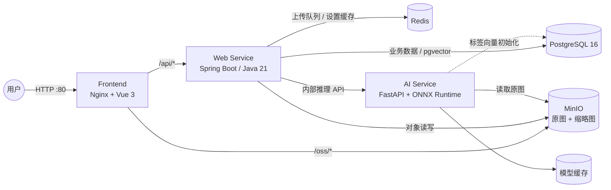

# BaKaBooru


一个本地优先的 AI 图库管理系统：支持自动打标、CLIP 语义检索、以图搜图、标签与元数据组合过滤，并将图片和模型保留在本地环境中。

## 核心能力

- **多模态检索**：CLIP 文本/视觉向量配合 pgvector，实现自然语言搜图与以图搜图。
- **自动化入库**：上传后自动计算 SHA-256、查重、解析尺寸、归档原图并生成缩略图。
- **AI 自动标注**：Camie Tagger 识别标签，推理失败可追踪、可手动重试。
- **组合筛选**：按标签、关键字、AI 状态、宽高、文件大小和排序条件检索。
- **本地优先**：PostgreSQL、MinIO、Redis 和模型推理均由 Docker Compose 在本地编排。

## 架构概览


```mermaid
flowchart LR
    User(("用户")) -->|"HTTP :80"| Front["Frontend<br/>Nginx + Vue 3"]
    Front -->|"/api/*"| Web["Web Service<br/>Spring Boot / Java 21"]
    Front -->|"/oss/*"| MinIO[("MinIO<br/>原图 + 缩略图")]

    Web -->|"业务数据 / pgvector"| PG[("PostgreSQL 16")]
    Web -->|"上传队列 / 设置缓存"| Redis[("Redis")]
    Web -->|"对象读写"| MinIO
    Web -->|"内部推理 API"| AI["AI Service<br/>FastAPI + ONNX Runtime"]
    AI -->|"读取原图"| MinIO
    AI --> Cache[("模型缓存")]
    AI -.->|"标签向量初始化"| PG
```

Web Service 是业务入口；AI Service 只负责打标与向量推理。上传入库和 AI 后处理是两个异步阶段，因此模型加载或暂时不可用时，普通浏览、管理和非语义检索仍能工作。

更完整的服务边界、上传时序与检索路径见[系统架构文档](docs/architecture.md)。

## 快速开始

### 前置要求

- Docker 与 Docker Compose
- 默认 Compose 配置使用 GPU：需要 NVIDIA Driver 与 NVIDIA Container Toolkit

### 启动

```bash
docker compose up -d --build
docker compose ps
```

浏览器访问 `http://localhost`。首次运行需要下载 AI 模型，`backend-ai-service` 的 `/health` 会先返回 `loading`，模型全部加载后变为 `ok`。

> 根目录 Compose 包含演示用默认密码，且将 MinIO bucket 配置为匿名可读。对外部署前请先阅读[部署指南](docs/deployment.md)并更换凭据。

### 本地开发

先启动基础设施：

```bash
docker compose up -d db minio redis minio-createbuckets
```

分别运行三个应用：

```bash
# Web Service（需配置 application.yml 引用的环境变量）
cd backend/web_service
mvn spring-boot:run
```

```bash
# AI Service（需配置 PostgreSQL、MinIO 与模型缓存环境变量）
cd backend/ai_service
pip install -r requirements.txt
uvicorn app.main:app --reload
```

```bash
# Frontend
cd frontend
pnpm install
pnpm dev
```

前端开发地址默认是 `http://localhost:5173`，Vite 会把 `/api` 和 `/oss` 分别代理到本地 Web Service 与 MinIO。

## 目录结构

```text
bakabooru/
├── backend/
│   ├── web_service/       # Spring Boot 业务 API、队列和持久化
│   └── ai_service/        # FastAPI 模型推理
├── frontend/              # Vue 3 + TypeScript
├── docs/                  # 架构、模块、部署和运维文档
├── data/                  # Compose 持久化数据（本地生成）
└── docker-compose.yml     # 完整本地编排
```

## 常用配置

| 变量 | 默认值 | 说明 |
| --- | --- | --- |
| `THUMBNAIL_MAX_SIZE` | `1024` | 缩略图最大边长，像素 |
| `THUMBNAIL_QUALITY` | `0.85` | 缩略图输出质量 |
| `THUMBNAIL_FORMAT` | `jpg` | 缩略图格式 |
| `AI_CONCURRENCY` | `10` | Web Service AI 后处理线程数 |
| `MODEL_CACHE_DIR` | `/model_cache` | AI 容器内模型缓存路径 |
| `AI_SERVICE_URL` | `http://backend-ai-service:8000` | Web 到 AI 的内部地址 |

数据库、Redis、MinIO、GPU/CPU 和全部配置说明见[部署指南](docs/deployment.md)。

## 文档

| 文档 | 内容 |
| --- | --- |
| [文档导航](docs/README.md) | 推荐阅读路径与术语约定 |
| [系统架构](docs/architecture.md) | 服务边界、上传/检索数据流与可用性 |
| [Web Service](docs/backend-web-service.md) | Java 模块、API、上传队列、AI 状态机 |
| [AI Service](docs/ai-service.md) | 模型、推理接口、加载生命周期和数据边界 |
| [前端](docs/frontend.md) | 页面、路由、状态管理与交互流程 |
| [数据模型](docs/data-model.md) | ER 图、向量字段、对象映射与索引 |
| [部署指南](docs/deployment.md) | Compose 依赖、端口、卷和环境变量 |
| [运维手册](docs/operations.md) | 健康检查、失败恢复、backfill 与备份 |
