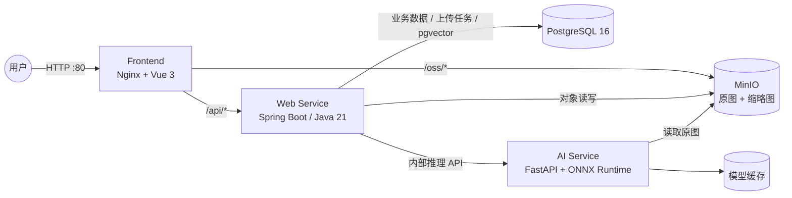

# BaKaBooru


一个使用 Docker Compose 自托管的 AI 图库管理系统：支持自动打标、CLIP 语义检索、以图搜图、标签与元数据组合过滤，并将图片和模型保留在自己的基础设施中。

## 核心能力

- **多模态检索**：CLIP 文本/视觉向量配合 pgvector，实现自然语言搜图与以图搜图。
- **自动化入库**：上传后自动计算 SHA-256、查重、解析尺寸、归档原图并生成缩略图。
- **AI 自动标注**：Camie Tagger 识别标签，推理失败可追踪、可手动重试。
- **组合筛选**：按标签、关键字、AI 状态、宽高、文件大小和排序条件检索。
- **自托管部署**：PostgreSQL、MinIO 和模型推理统一由 Docker Compose 编排。

## 架构概览


```mermaid
flowchart LR
    User(("用户")) -->|"HTTP :80"| Front["Frontend<br/>Nginx + Vue 3"]
    Front -->|"/api/*"| Web["Web Service<br/>Spring Boot / Java 21"]
    Front -->|"/oss/*"| MinIO[("MinIO<br/>原图 + 缩略图")]

    Web -->|"业务数据 / 上传任务 / pgvector"| PG[("PostgreSQL 16")]
    Web -->|"对象读写"| MinIO
    Web -->|"内部推理 API"| AI["AI Service<br/>FastAPI + ONNX Runtime"]
    AI -->|"读取原图"| MinIO
    AI --> Cache[("模型缓存")]
```

Web Service 是业务入口；AI Service 只负责打标与向量推理。上传入库和 AI 后处理是两个异步阶段，因此模型加载或暂时不可用时，普通浏览、管理和非语义检索仍能工作。

更完整的服务边界、上传时序与检索路径见[系统架构文档](docs/architecture.md)。

## 快速开始

### 前置要求

- Docker 与 Docker Compose
- 默认 Compose 配置使用 GPU：需要 NVIDIA Driver 与 NVIDIA Container Toolkit

### 启动

```bash
cp .env.example .env
# 编辑 .env 并设置本地凭据
docker compose up -d --build
docker compose ps
```

浏览器访问 `http://localhost`。首次运行需要下载 AI 模型，`ai-service` 的 `/health` 会先返回 `loading`，模型全部加载后变为 `ok`。

> 本地凭据保存在不会提交到 Git 的 `.env` 中。当前 MinIO bucket 会初始化为匿名可读；对外部署前请先阅读[部署指南](docs/deployment.md)。

## 目录结构

```text
bakabooru/
├── web-service/           # Spring Boot 业务 API、任务调度和持久化
├── ai-service/            # FastAPI 模型推理
├── frontend/              # Vue 3 + TypeScript
├── docs/                  # 架构、模块、部署和运维文档
├── data/                  # Compose 持久化数据
└── docker-compose.yml     # 完整容器编排
```

## 配置方式

- `.env` 保存 PostgreSQL、MinIO 与监控账号凭据，只用于本地部署且不会提交 Git。
- 服务地址、缩略图规格和 Worker 调度参数由应用提供适合 Compose 的默认值。
- 标签阈值、AI 重试策略和上传任务保留期可在系统设置页中修改并立即作用于后续任务。

完整配置说明见[部署指南](docs/deployment.md)。

## 文档

| 文档 | 内容 |
| --- | --- |
| [文档导航](docs/README.md) | 推荐阅读路径与术语约定 |
| [系统架构](docs/architecture.md) | 服务边界、上传/检索数据流与可用性 |
| [Web Service](docs/backend-web-service.md) | Java 模块、API、上传队列、AI 状态机 |
| [AI Service](docs/ai-service.md) | 模型、推理接口、加载生命周期和数据边界 |
| [前端](docs/frontend.md) | 页面、路由、状态管理与交互流程 |
| [数据模型](docs/data-model.md) | ER 图、向量字段、对象映射与索引 |
| [部署指南](docs/deployment.md) | Compose 依赖、端口、卷和环境变量 |
| [运维手册](docs/operations.md) | 健康检查、失败恢复、backfill 与备份 |
