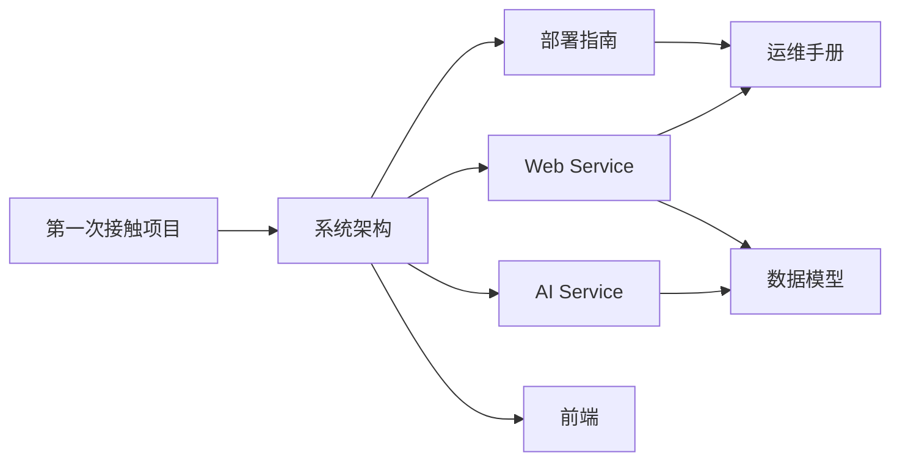

# BaKaBooru 文档

BaKaBooru 是一个本地优先的 AI 图库管理系统。业务入口由 Spring Boot Web Service 统一提供，FastAPI AI Service 专注模型推理；PostgreSQL/pgvector、MinIO 和 Redis 分别承载结构化数据、图片对象与队列/缓存。

## 阅读路径

| 文档 | 适合解决的问题 |
| --- | --- |
| [系统架构](architecture.md) | 服务如何分工，上传、检索和 AI 后处理如何跨服务流转？ |
| [Web Service](backend-web-service.md) | Java 模块、HTTP API、上传队列和异步 AI 管线如何实现？ |
| [AI Service](ai-service.md) | 模型如何加载，推理接口有哪些，哪些数据会被直接访问？ |
| [前端](frontend.md) | 页面、路由、状态管理与 API 交互如何组织？ |
| [数据模型](data-model.md) | 表、关系、向量维度、索引和对象路径是什么？ |
| [部署指南](deployment.md) | Compose 服务如何启动，端口、卷和环境变量如何配置？ |
| [运维手册](operations.md) | 如何查看健康状态、恢复失败任务、补缩略图和排障？ |

## 文档约定

- “Web Service”指 `backend/web_service` 中的 Spring Boot 服务。
- “AI Service”指 `backend/ai_service` 中的 FastAPI 服务。
- “上传任务”指 Redis 中负责文件入库的任务；“AI 后处理”指图片入库后的打标与 CLIP 向量计算，两者是独立阶段。
- 配置默认值以根目录 `docker-compose.yml` 和各服务配置文件为准；文档用于解释含义和依赖关系。
