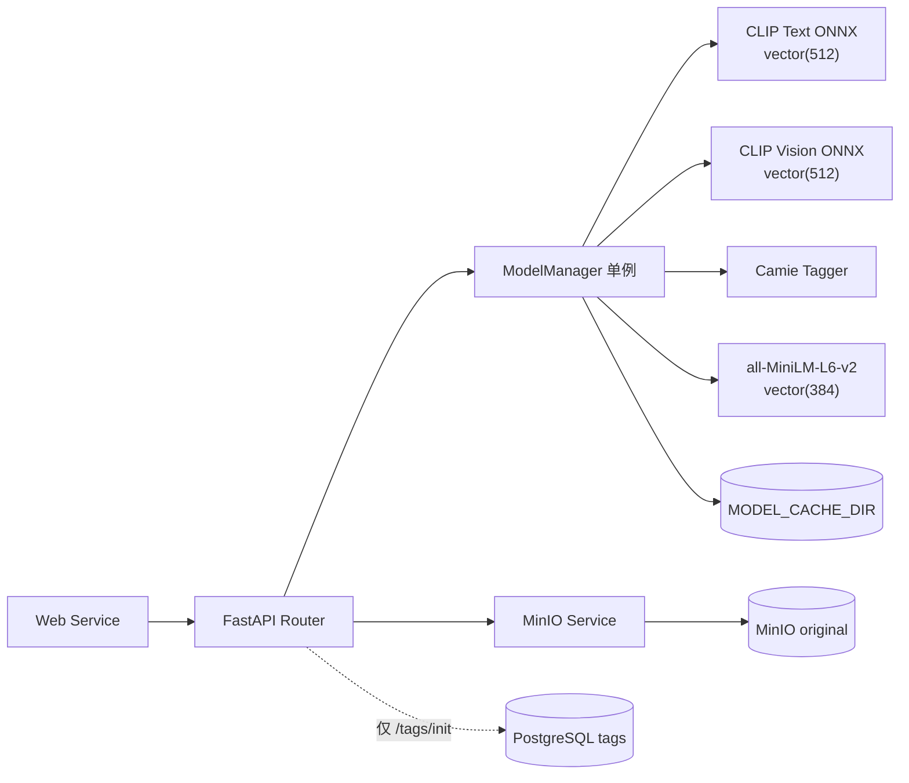
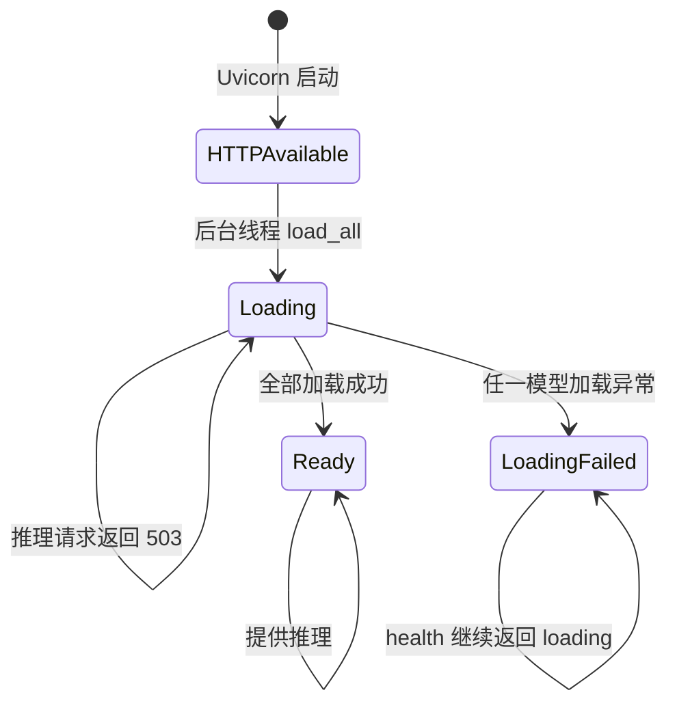
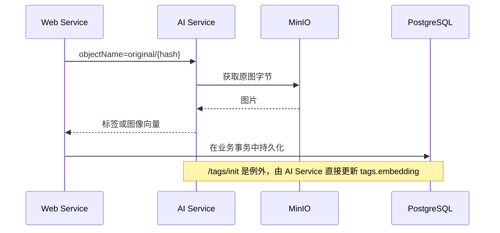

# AI Service

AI Service 位于 `backend/ai_service`，使用 FastAPI 与 ONNX Runtime。它提供模型推理能力，不维护图片的业务状态；Web Service 负责调用、事务和失败恢复。

## 内部结构

## 接口

| 方法与路径 | 输入 | 输出/作用 |
| --- | --- | --- |
| `GET /health` | 无 | `status=loading` 或 `status=ok` |
| `POST /tag/image` | MinIO object name、阈值 | 标签名到置信度分数 |
| `POST /search/embedding` | 文本 query | 归一化 CLIP 文本向量 `512` 维 |
| `POST /embedding/image` | MinIO object name | 归一化 CLIP 图像向量 `512` 维 |
| `POST /embedding/image-file` | multipart 图片 | 归一化 CLIP 图像向量 `512` 维 |
| `POST /tags/init` | 无 | 为 `tags.embedding IS NULL` 记录生成 `384` 维向量 |

FastAPI 的交互式接口文档默认位于服务内部端口 `8000` 的 `/docs`。

## 模型生命周期

HTTP 服务启动不会等待模型下载完成。`lifespan` 创建后台线程执行 `ModelManager.load_all()`；所有模型成功加载后 `ready` 才变为 `true`。受保护的推理路由在此前返回 `503`。Compose 健康检查只验证 `/health` 能返回 HTTP 响应，因此容器可健康但模型仍处于 `loading`。

当前加载顺序为：

1. FastEmbed `sentence-transformers/all-MiniLM-L6-v2`，用于标签语义向量。
2. Camie Tagger，用于图片标签识别。
3. `Xenova/clip-vit-base-patch32` 的文本与视觉 ONNX 模型及 CLIP Processor。

`DEVICE=auto` 时优先使用 `CUDAExecutionProvider`，不可用则回退 `CPUExecutionProvider`。Compose 默认声明 `gpus: all`，CPU-only 部署需要同步调整 Compose 配置与运行时依赖。

## 数据访问边界

- 常规推理不直接修改 `images` 或 `image_tag_relation`。
- `/embedding/image-file` 直接读取请求文件，不经过 MinIO。
- 服务不调用在线 LLM；首次运行仅需要访问模型仓库下载权重，缓存完成后可离线复用。

## 关键配置

| 变量 | 含义 |
| --- | --- |
| `MODEL_CACHE_DIR` | Hugging Face、ONNX 与 Tagger 模型缓存目录 |
| `DEVICE` | `auto`、`cuda` 或 `cpu` |
| `MINIO_HOST/PORT` | 原图对象存储地址 |
| `MINIO_ACCESS_KEY/SECRET_KEY` | 对象存储凭据 |
| `MINIO_BUCKET_NAME` | 图片 bucket，Compose 默认 `images` |
| `DB_HOST/PORT/USER/PASS/NAME` | `/tags/init` 使用的 PostgreSQL 连接 |
