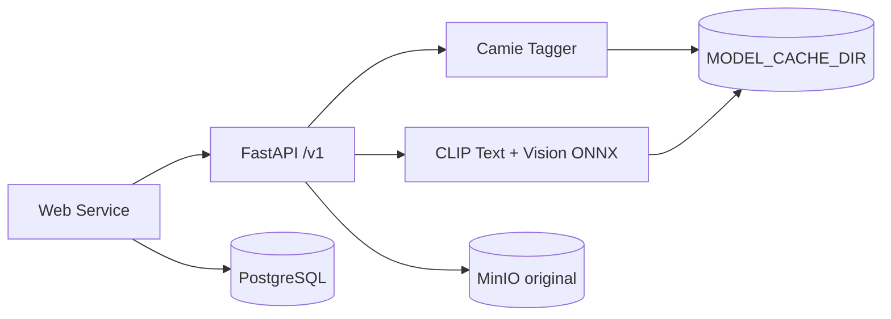

# AI Service

AI Service 位于根目录的 `ai-service`，使用 FastAPI 与 ONNX Runtime。它是无数据库状态的推理服务：Web Service 管理业务状态、任务、事务和失败恢复，AI Service 只读取 MinIO 原图并返回推理结果。

## 服务边界

```mermaid
flowchart LR
    Web["Web Service"] --> API["FastAPI /v1"]
    API --> Tagger["Camie Tagger"]
    API --> Clip["CLIP Text + Vision ONNX"]
    API --> MinIO[("MinIO original")]
    Tagger --> Cache[("MODEL_CACHE_DIR")]
    Clip --> Cache
    Web --> PG[("PostgreSQL")]
```

AI Service 没有 PostgreSQL 凭据，不读取或更新业务表。标签、图片向量和 Job 状态均由 Web Service 在事务中写入。

## 接口

| 方法与路径 | 输入 | 输出 |
| --- | --- | --- |
| `GET /health` | 无 | `status=loading` 或 `status=ok` |
| `POST /v1/images/analyze` | MinIO `object_name`、打标阈值 | 标签分数与 512 维 CLIP 图片向量 |
| `POST /v1/embeddings/text` | 文本 `query` | 文本与 512 维 CLIP 文本向量 |
| `POST /v1/embeddings/image-file` | multipart 图片 | 512 维 CLIP 图片向量 |

`/v1/images/analyze` 只从 MinIO 下载并解码一次图片，再对同一个 PIL Image 执行打标和视觉编码。所有推理路由共享单并发信号量，避免跨接口争用同一 GPU。推理错误使用标准非 2xx HTTP 响应。旧的 `/tag/image`、`/embedding/*`、`/search/embedding` 和 `/tags/init` 已移除。

FastAPI 交互文档位于内部端口 `8000` 的 `/docs`。`tests/snapshots/openapi.json` 是提交到仓库的接口契约快照。

## 模型生命周期

HTTP 服务启动后，后台线程执行 `ModelManager.load_all()`。模型未就绪时推理接口返回 `503`，全部加载完成后 `/health` 返回 `ok`。

当前只加载：

1. Camie Tagger，用于图片标签识别。
2. `Xenova/clip-vit-base-patch32` 文本、视觉 ONNX 模型和 Processor。

ONNX、Transformers 和模型目录初始化都延迟到 `load_all()`，因此导入 API、生成 OpenAPI 和运行轻量契约测试不需要初始化 GPU Runtime。`DEVICE=auto` 时优先 CUDA，不可用时回退 CPU。

## 配置

| 变量 | 含义 |
| --- | --- |
| `MODEL_CACHE_DIR` | 模型权重与处理器缓存目录 |
| `DEVICE` | `auto`、`cuda` 或 `cpu` |
| `MINIO_HOST/PORT` | 原图对象存储地址 |
| `MINIO_ACCESS_KEY/SECRET_KEY` | MinIO 凭据；服务代码只执行读取 |
| `MINIO_BUCKET_NAME` | 图片 bucket，Compose 默认 `images` |

生产依赖位于 `requirements.txt`，API/契约测试依赖位于 `requirements-test.txt`。
