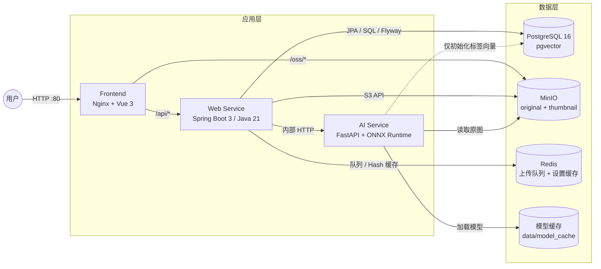
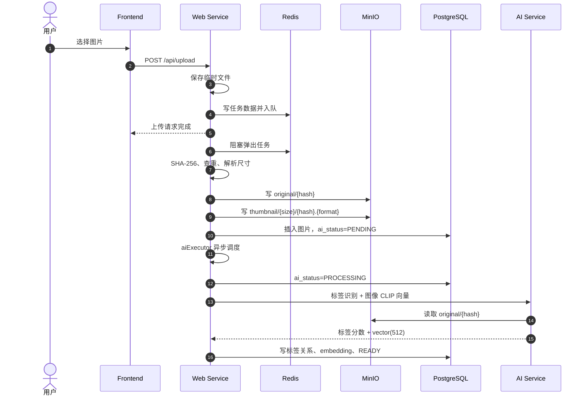
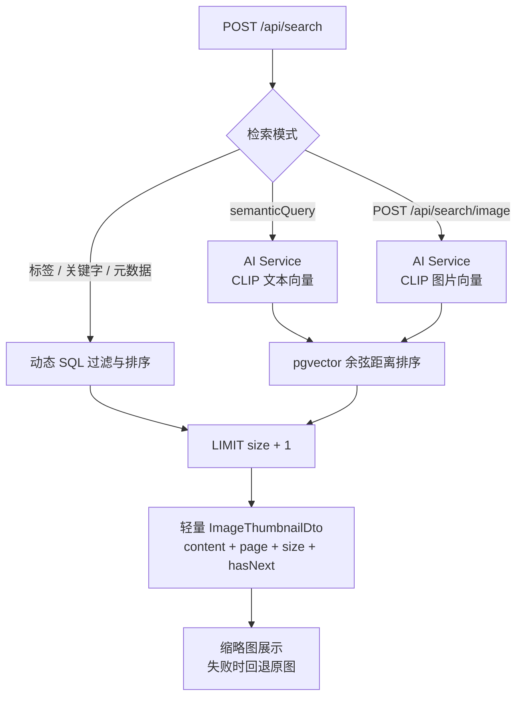

# 系统架构

BaKaBooru 采用本地优先、业务与推理解耦的服务架构。浏览器只访问 Nginx；Nginx 提供前端资源并代理 `/api/*` 与 `/oss/*`。Web Service 是业务数据的唯一写入入口，AI Service 负责模型推理，仅标签向量初始化会直接更新 PostgreSQL。

## 容器与依赖

## 服务边界

| 组件 | 负责 | 不负责 |
| --- | --- | --- |
| Frontend | 页面、交互、查询缓存、上传进度、令牌携带 | 直接访问数据库或推理服务 |
| Web Service | 鉴权、业务 API、事务、元数据、对象路径、上传队列、AI 调度 | 执行模型推理 |
| AI Service | Camie Tagger、CLIP 文本/图像向量、标签向量初始化 | 图片业务状态、上传任务、鉴权 |
| PostgreSQL | 图片、标签、关系、设置、向量与索引 | 图片二进制文件 |
| MinIO | 原图与固定规格缩略图 | 图片元数据与状态 |
| Redis | 上传任务队列/任务数据、失败队列、系统设置缓存 | 最终业务事实来源 |

## 上传与 AI 后处理

上传入库由单线程任务消费者处理；入库成功后，AI 后处理进入独立的 `aiExecutor` 线程池。两阶段分离，因此图片可以先出现在图库中，再异步转为 `READY`。

失败点分属两个队列语义：文件入库失败会进入 Redis 失败队列，可从上传页重试；AI 推理失败会让图片回到 `PENDING` 并记录 `ai_error`，可从详情页重试。

## 检索路径

- 普通筛选不依赖 AI Service。
- 语义搜索和以图搜图只检索 `embedding IS NOT NULL` 的图片。
- 分页通过多取一条计算 `hasNext`，不执行精确总数统计。
- 列表返回确定性的对象 URL，不逐条访问 MinIO 做存在性检查。

## 一致性与可用性

- PostgreSQL 是图片元数据、标签关系和运行时设置的事实来源。
- Redis 中的设置缓存在 Web Service 启动时由数据库预热；缓存缺失时会回源。
- AI Service 的 `/health` 表示进程可访问，并通过 `status=loading|ok` 暴露模型状态；推理接口在模型未就绪时返回 `503`。
- Web Service 不依赖 AI Service 健康检查启动，因此 AI 模型加载期间仍可登录、浏览和进行非语义检索。
