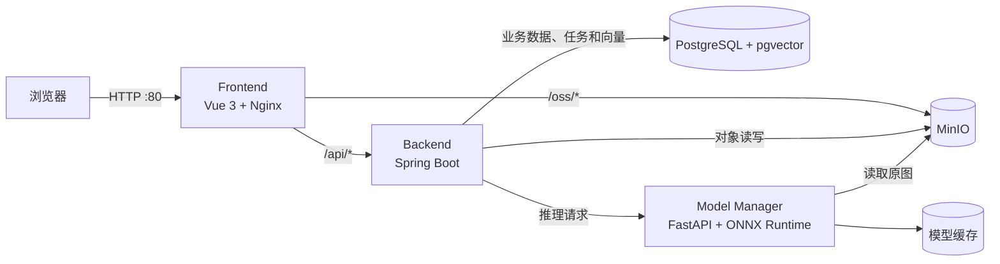

# 架构设计

## 服务边界

```mermaid
flowchart LR
    User[浏览器] -->|HTTP :80| Frontend[Frontend<br/>Vue 3 + Nginx]
    Frontend -->|/api/*| Backend[Backend<br/>Spring Boot]
    Frontend -->|/oss/*| MinIO[(MinIO)]
    Backend -->|业务数据、任务和向量| PostgreSQL[(PostgreSQL + pgvector)]
    Backend -->|对象读写| MinIO
    Backend -->|推理请求| Manager[Model Manager<br/>FastAPI + ONNX Runtime]
    Manager -->|读取原图| MinIO
    Manager --> Cache[(模型缓存)]
```

| 组件 | 职责 |
| --- | --- |
| Frontend | 页面、交互和 API/图片代理 |
| Backend | 鉴权、事务、图片元数据、标签、模型目录和持久化任务 |
| Model Manager | 无业务数据库的模型加载、标签推理和向量计算 |
| PostgreSQL | 业务数据、系统设置、上传任务、分析任务和向量 |
| MinIO | 暂存文件、原图和缩略图 |

## Backend 模块

- `controller`：HTTP 接入层。`ModelManagerController` 管理模型目录；`ImageAnalysisController` 管理图片分析接口；`ImageController` 只管理图片本身。
- `module.image`：图片实体、标签关系、图片 CRUD、搜索查询和对象存储。
- `module.analysis`：分析请求 DTO、`AnalysisJob`、任务仓储、入队服务和后台 Worker。
- `module.model`：模型实体和目录、`ModelManagerClient`、文本/图片向量服务。
- `module.search`：组合搜索和语义搜索编排。
- `module.upload`：上传任务、文件归档和入库 Worker。
- `module.system`：系统设置和认证。

## 核心流程

上传请求先将文件写入 MinIO 暂存区，并在 PostgreSQL 创建上传任务后返回。上传 Worker 归档原图、生成缩略图和图片记录，再创建分析任务。分析 Worker 使用数据库租约领取任务，调用 Model Manager，成功后保存标签和向量；失败任务按退避策略重试。

普通图库查询不依赖模型服务。模型服务不可用时，分析任务保留在数据库中，待服务恢复后继续处理。

## 一致性

- PostgreSQL 是业务状态的事实来源，Model Manager 不写业务数据库。
- MinIO 对象和 PostgreSQL 记录由 Backend 任务流程协调，不使用分布式事务。
- 上传状态和分析状态分开记录，分别表示文件入库和模型分析进度。
- `FOR UPDATE SKIP LOCKED` 和租约字段支持 Worker 崩溃恢复。
