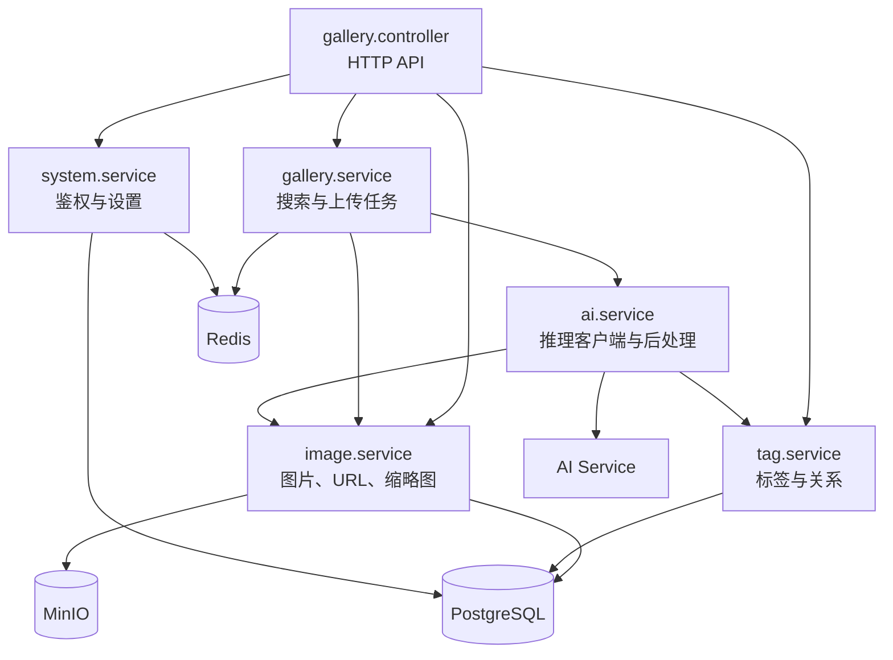
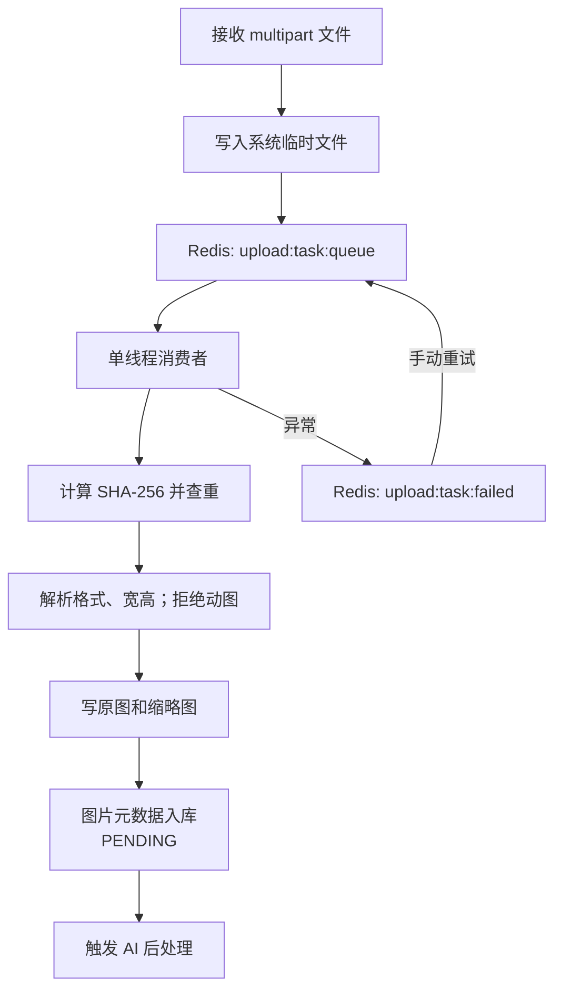
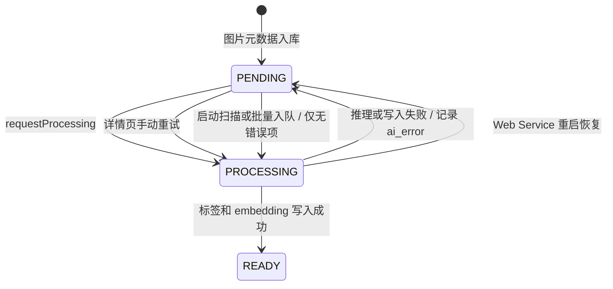

# Web Service

Web Service 位于 `backend/web_service`，是系统的业务核心和对外 API 边界。它使用 Java 21、Spring Boot 3.5、JPA/JdbcTemplate、Flyway、Redis 与 MinIO，并通过内部 HTTP 调用 AI Service。

## 模块结构

| 包 | 主要职责 |
| --- | --- |
| `module.gallery` | API 控制器、搜索编排、上传任务与 Redis 队列 |
| `module.image` | 图片实体/DTO、搜索 SQL、对象 URL、缩略图与文件存储 |
| `module.tag` | 标签字典、标签查询、图片标签关系 |
| `module.ai` | AI HTTP 客户端、图像 embedding、异步后处理 |
| `module.system` | 首次初始化、JWT 校验、设置持久化与 Redis 缓存 |
| `config` | Web 拦截器、线程池、Redis、MinIO 与属性绑定 |

## HTTP API

所有业务接口都以 `/api` 开头；除认证白名单外，请求由 `AuthInterceptor` 校验 `Authorization: Bearer <token>`。

| 资源 | 代表性接口 | 用途 |
| --- | --- | --- |
| 认证 | `GET /api/auth/status`、`POST /api/auth/setup`、`POST /api/auth/login` | 首次初始化、登录与令牌签发 |
| 搜索 | `POST /api/search`、`POST /api/search/image` | 条件/语义检索、以图搜图 |
| 图片 | `GET/PUT/DELETE /api/images/{id}` | 详情、编辑、删除 |
| 图片标签 | `POST/DELETE /api/images/{id}/tags/{tagId}` | 手工维护标签 |
| AI 管理 | `POST /api/images/{id}/ai/retry`、`POST /api/images/ai/enqueue-all` | 单图重试、批量入队 |
| 批量操作 | `POST /api/images/batch/delete`、`POST /api/images/batch/download` | 批量删除、ZIP 下载 |
| 上传 | `POST /api/upload`、`GET/POST/DELETE /api/upload/tasks` | 创建、查看、重试、清理上传任务 |
| 标签/设置 | `GET /api/tags`、`GET/POST /api/system/settings` | 标签检索与运行时设置 |

开发环境可通过 Springdoc 页面查看由控制器注解生成的完整接口定义：`/swagger-ui/index.html`。

## 上传任务

任务数据键为 `upload:task:data:{id}`，有效期为 3 天。待处理与失败任务存 Redis List；当前运行中的任务保存在 Web Service 进程内。文件成功入库后任务数据会删除，临时文件在处理结束时清理。

## AI 后处理状态机

- `aiExecutor` 与上传消费者分离，并发数由 `AI_CONCURRENCY` 控制，默认 `10`。
- 打标阈值来自运行时设置 `tag.threshold`。
- 完成阶段在事务中写入图像 `vector(512)`、新标签关系与时间戳。
- 失败后不会无限自动重试：状态回到 `PENDING`，错误写入 `ai_error`；启动扫描和批量入队会跳过仍有错误的记录。

## 搜索实现

`SearchService` 负责选择检索路径，`ImageSearchService` 使用 JdbcTemplate/native SQL 完成过滤和排序。

- 条件检索支持标签、关键字、AI 状态、宽高、文件大小、排序和随机种子。
- `semanticQuery` 先调用 AI Service 生成 CLIP 文本向量，再用 pgvector 距离排序。
- 以图搜图把 multipart 文件直接转发给 AI Service 生成视觉向量，不创建临时 MinIO 对象。
- 查询使用 `LIMIT size + 1` 计算 `hasNext`，响应不包含精确总数。
- 列表 DTO 只包含展示所需字段和可推导的 MinIO URL，降低对象存储访问次数。

## 配置与持久化

Flyway 在启动时执行 `src/main/resources/db/migration`。Hibernate 使用 `ddl-auto: validate`，因此表结构变更应新增 migration，而不是依赖实体自动改表。

运行时设置保存在 `system_settings`，并缓存于 Redis Hash `system:settings`。缩略图规格和 AI 线程池大小属于部署配置，来自 `application.yml` 对应的环境变量，不属于运行时设置。
