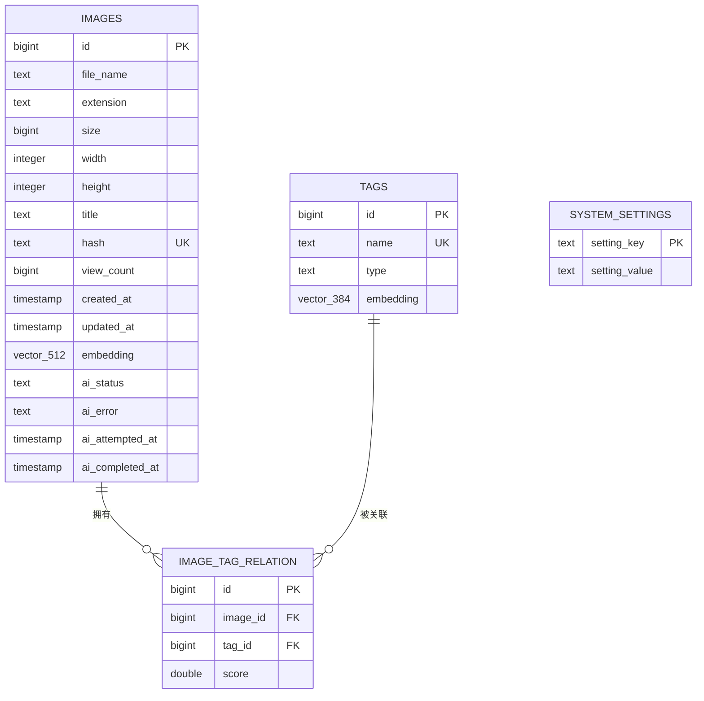
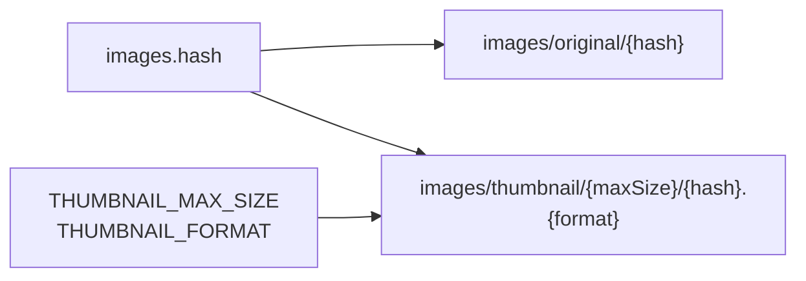
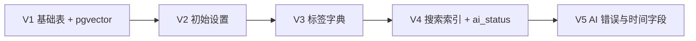

# 数据模型

PostgreSQL 16 与 pgvector 保存业务元数据、运行时设置和两类向量。结构由 Flyway migration 管理，Hibernate 仅校验映射。

## 实体关系

`system_settings` 与其他表没有外键关系；它保存少量可在 UI 修改的运行时设置。

## 表说明

### `images`

`hash` 是文件内容的 SHA-256，同时用于查重和构造对象存储路径。`embedding` 是归一化的 CLIP 图像向量，维度为 `512`；为空的图片不能参与语义或相似度检索。

AI 字段含义：

| 字段 | 含义 |
| --- | --- |
| `ai_status` | `PENDING`、`PROCESSING` 或 `READY` |
| `ai_error` | 最近一次后处理错误；成功或重新开始时清空 |
| `ai_attempted_at` | 最近一次进入处理的时间 |
| `ai_completed_at` | 最近一次成功完成的时间 |

### `tags`

`name` 全局唯一，`type` 表示标签类别。`embedding` 是 `all-MiniLM-L6-v2` 生成的 `384` 维文本向量，用于标签语义匹配/扩展，不等同于图片的 CLIP 向量。

### `image_tag_relation`

图片与标签的多对多关联，`(image_id, tag_id)` 唯一。`score` 对 AI 标签表示置信度；手工添加标签也通过同一关系表保存。

### `system_settings`

当前 migration 提供的主要键包括：

| 键 | 默认值 | 用途 |
| --- | --- | --- |
| `system.auth-initialized` | `false` | 是否完成首次认证初始化 |
| `system.auth-password` | 空 | Base64 编码的当前密码 |
| `upload.poll-interval` | `1000` | 前端上传任务轮询间隔，毫秒 |
| `tag.threshold` | `0.61` | AI 自动打标阈值 |

这些值以数据库为事实来源，并缓存到 Redis `system:settings`。缩略图规格由环境变量配置，不存于此表。

## 对象存储映射

`images` 是 Compose 创建的 bucket。数据库删除与对象清理由 Web Service 编排；数据库只保存 hash 和原始扩展名，不保存二进制内容。

## 索引

| 索引 | 目的 |
| --- | --- |
| `idx_images_embedding` | HNSW + cosine，CLIP 相似度检索 |
| `idx_tags_embedding` | HNSW + cosine，标签语义向量检索 |
| `idx_tags_name_lower_btree` | 不区分大小写的标签前缀查询 |
| `idx_image_tag_relation_tag_image` | 按标签筛图片 |
| `idx_images_ai_status` | AI 状态筛选 |
| `idx_images_created_at` | 默认时间排序 |
| `idx_images_size` | 文件大小过滤 |
| `idx_images_dimensions` | 宽高过滤 |

## 迁移策略

新增字段、约束或索引时应追加新的版本化 SQL，不要修改已在环境中执行过的 migration。
