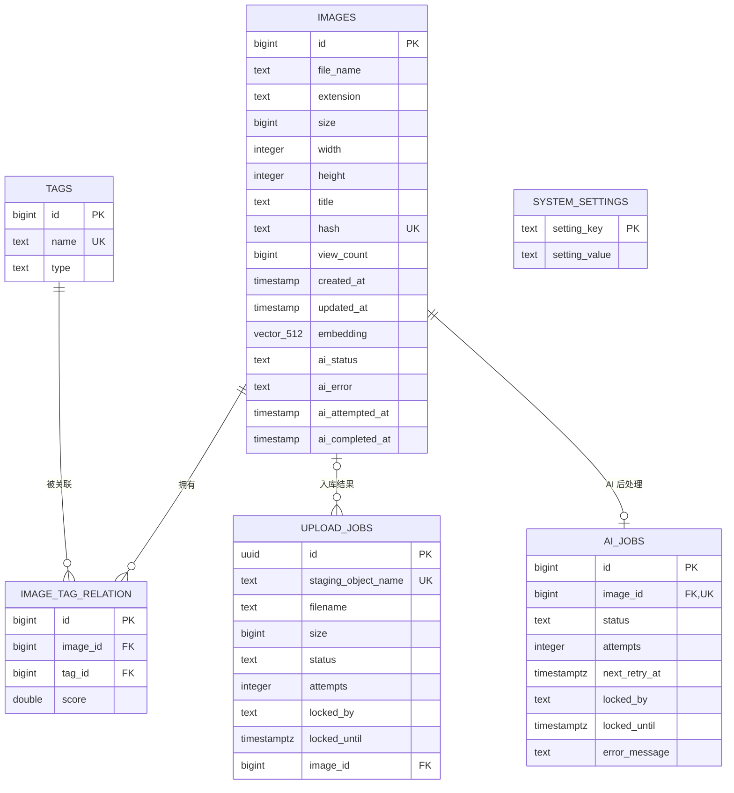
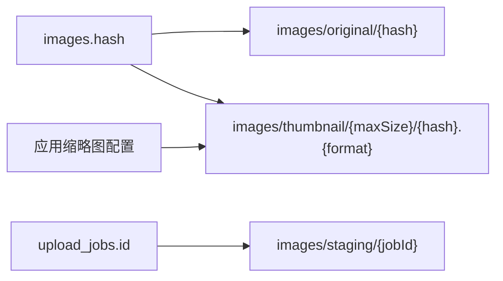
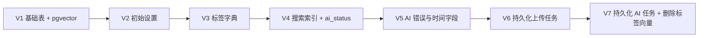

# 数据模型

PostgreSQL 16 与 pgvector 保存业务元数据、持久化任务、运行时设置和 CLIP 图片向量。结构由 Flyway migration 管理，Hibernate 仅校验映射。

## 实体关系

```mermaid
erDiagram
    IMAGES ||--o{ IMAGE_TAG_RELATION : "拥有"
    TAGS ||--o{ IMAGE_TAG_RELATION : "被关联"

    IMAGES {
        bigint id PK
        text file_name
        text extension
        bigint size
        integer width
        integer height
        text title
        text hash UK
        bigint view_count
        timestamp created_at
        timestamp updated_at
        vector_512 embedding
        text ai_status
        text ai_error
        timestamp ai_attempted_at
        timestamp ai_completed_at
    }

    TAGS {
        bigint id PK
        text name UK
        text type
    }

    IMAGE_TAG_RELATION {
        bigint id PK
        bigint image_id FK
        bigint tag_id FK
        double score
    }

    SYSTEM_SETTINGS {
        text setting_key PK
        text setting_value
    }

    UPLOAD_JOBS {
        uuid id PK
        text staging_object_name UK
        text filename
        bigint size
        text status
        integer attempts
        text locked_by
        timestamptz locked_until
        bigint image_id FK
    }

    IMAGES o|--o{ UPLOAD_JOBS : "入库结果"
    IMAGES ||--o| AI_JOBS : "AI 后处理"

    AI_JOBS {
        bigint id PK
        bigint image_id FK,UK
        text status
        integer attempts
        timestamptz next_retry_at
        text locked_by
        timestamptz locked_until
        text error_message
    }
```

`system_settings` 与其他表没有外键关系；它保存少量可在 UI 修改的运行时设置。

## 表说明

### `images`

`hash` 是文件内容的 SHA-256，同时用于查重和构造对象存储路径。`embedding` 是归一化的 CLIP 图像向量，维度为 `512`；为空的图片不能参与语义或相似度检索。

AI 字段含义：

| 字段 | 含义 |
| --- | --- |
| `ai_status` | `PENDING`、`PROCESSING`、`READY` 或 `FAILED` |
| `ai_error` | 最近一次后处理错误；成功或重新开始时清空 |
| `ai_attempted_at` | 最近一次进入处理的时间 |
| `ai_completed_at` | 最近一次成功完成的时间 |

### `tags`

`name` 全局唯一，`type` 表示标签类别。标签查询使用名称前缀匹配；历史上未被使用的 384 维标签向量已由 V7 删除。

### `image_tag_relation`

图片与标签的多对多关联，`(image_id, tag_id)` 唯一。`score` 对 AI 标签表示置信度；手工添加标签也通过同一关系表保存。

### `system_settings`

当前 migration 提供的主要键包括：

| 键 | 默认值 | 用途 |
| --- | --- | --- |
| `system.auth-initialized` | `false` | 是否完成首次认证初始化 |
| `system.auth-password` | 空 | Base64 编码的当前密码 |
| `tag.threshold` | `0.61` | AI 自动打标阈值 |
| `ai-job.max-attempts` | `5` | AI 任务最大尝试次数 |
| `ai-job.retry-base-delay-seconds` | `30` | AI 指数退避初始延迟，秒 |
| `ai-job.retry-max-delay-seconds` | `1800` | AI 指数退避最大延迟，秒 |
| `upload.completed-retention-days` | `7` | 已完成上传任务保留天数 |

这些值直接以数据库为事实来源。通用设置 API 仅返回可编辑业务配置，不返回认证密码或初始化标记。缩略图规格由应用启动配置提供，不存于此表。

### `upload_jobs`

上传任务状态为 `PENDING`、`PROCESSING`、`COMPLETED` 或 `FAILED`。待处理文件位于 MinIO `staging/{jobId}`；Worker 使用 `FOR UPDATE SKIP LOCKED` 领取任务，通过 `locked_by` 与 `locked_until` 实现租约和崩溃恢复。成功后 `image_id` 指向入库图片，失败任务保留 staging 对象以支持重试。

### `ai_jobs`

每张需要 AI 后处理的图片最多对应一条任务。状态为 `PENDING`、`RUNNING`、`COMPLETED` 或 `FAILED`；`next_retry_at` 控制指数退避，`locked_by/locked_until` 提供多实例领取和崩溃恢复。图片删除时任务通过外键级联删除。

## 对象存储映射

```mermaid
flowchart LR
    Row["images.hash"] --> Original["images/original/{hash}"]
    Row --> Thumb["images/thumbnail/{maxSize}/{hash}.{format}"]
    Job["upload_jobs.id"] --> Staging["images/staging/{jobId}"]
    Config["应用缩略图配置"] --> Thumb
```

`images` 是 Compose 创建的 bucket。数据库删除与对象清理由 Web Service 编排；数据库只保存 hash 和原始扩展名，不保存二进制内容。

## 索引

| 索引 | 目的 |
| --- | --- |
| `idx_images_embedding` | HNSW + cosine，CLIP 相似度检索 |
| `idx_tags_name_lower_btree` | 不区分大小写的标签前缀查询 |
| `idx_image_tag_relation_tag_image` | 按标签筛图片 |
| `idx_images_ai_status` | AI 状态筛选 |
| `idx_images_created_at` | 默认时间排序 |
| `idx_images_size` | 文件大小过滤 |
| `idx_images_dimensions` | 宽高过滤 |
| `idx_upload_jobs_claimable` | 快速领取待处理或租约过期的上传任务 |
| `idx_upload_jobs_status_updated` | 上传状态统计与失败任务列表 |
| `idx_ai_jobs_pending` | 按重试时间领取待处理 AI 任务 |
| `idx_ai_jobs_expired_locks` | 查找租约过期的运行中 AI 任务 |

## 迁移策略

```mermaid
flowchart LR
    V1["V1 基础表 + pgvector"] --> V2["V2 初始设置"]
    V2 --> V3["V3 标签字典"]
    V3 --> V4["V4 搜索索引 + ai_status"]
    V4 --> V5["V5 AI 错误与时间字段"]
    V5 --> V6["V6 持久化上传任务"]
    V6 --> V7["V7 持久化 AI 任务 + 删除标签向量"]
```

新增字段、约束或索引时应追加新的版本化 SQL，不要修改已在环境中执行过的 migration。
