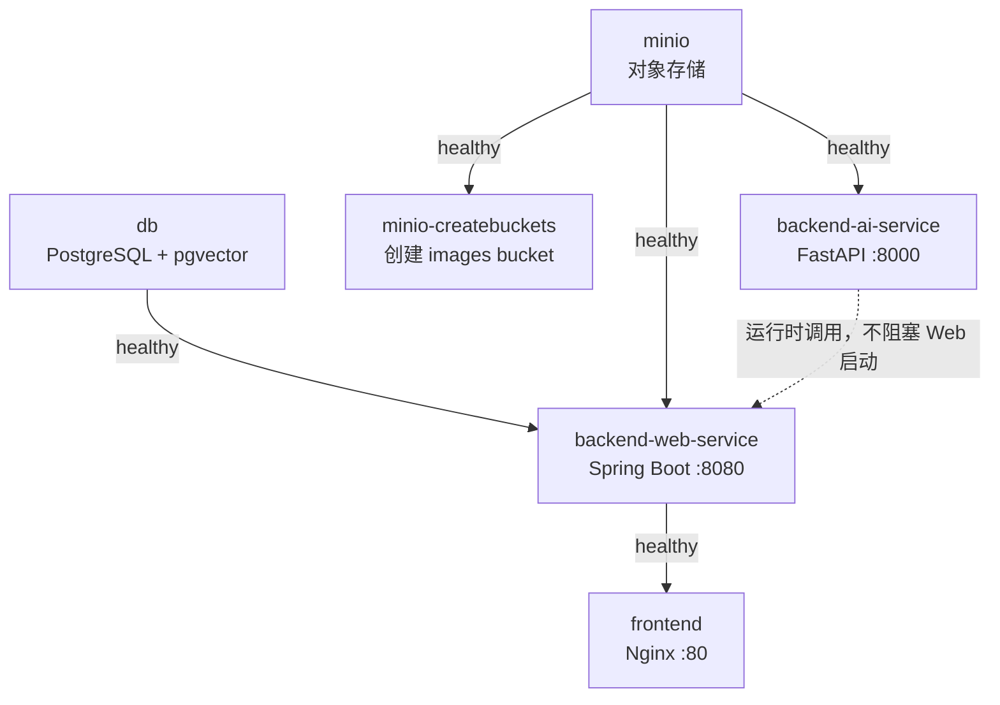
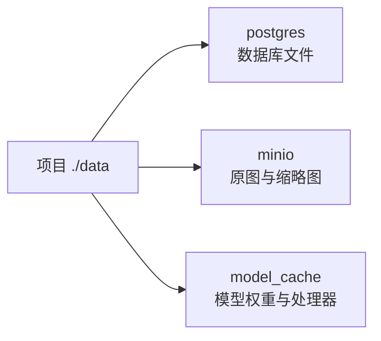

# 部署指南

根目录 `docker-compose.yml` 编排 6 个服务，其中 `minio-createbuckets` 是一次性初始化任务。默认部署面向带 NVIDIA GPU 的本机环境，业务数据与模型缓存都挂载到 `./data`。

## 服务拓扑与启动依赖


```mermaid
flowchart TD
    DB["db<br/>PostgreSQL + pgvector"]
    MinIO["minio<br/>对象存储"]
    Init["minio-createbuckets<br/>创建 images bucket"]
    AI["backend-ai-service<br/>FastAPI :8000"]
    Web["backend-web-service<br/>Spring Boot :8080"]
    Front["frontend<br/>Nginx :80"]

    MinIO -->|"healthy"| Init
    MinIO -->|"healthy"| AI
    DB -->|"healthy"| Web
    MinIO -->|"healthy"| Web
    Web -->|"healthy"| Front
    AI -.->|"运行时调用，不阻塞 Web 启动"| Web
```

AI Service 不在 Web Service 的 Compose `depends_on` 中。模型下载或加载期间，前端与 Web Service 可以启动，普通图库操作仍可使用。

> 从 Redis 上传队列版本升级时，旧队列中的待处理/失败任务不会迁移：这些任务引用旧 Web 进程的本地临时文件，无法可靠恢复，请在升级后重新上传。已完成入库的图片不受影响。确认升级正常后，可自行归档或删除不再使用的 `data/redis`。

## 快速启动

```bash
docker compose up -d --build
docker compose ps
```

访问入口：

| 地址 | 用途 |
| --- | --- |
| `http://localhost` | BaKaBooru 前端 |
| `http://localhost:9001` | MinIO 管理控制台 |
| `http://localhost:9000` | MinIO S3 API（默认对宿主机暴露） |
| `localhost:5432` | PostgreSQL（默认对宿主机暴露） |

Web 与 AI 服务没有映射到宿主机端口，通过 Compose 网络互访。首次启动时 Flyway 会执行数据库迁移（包括标签字典与持久化任务表），AI Service 会下载模型；耗时取决于网络、磁盘和 GPU 环境。AI Service 不需要数据库账号。

## 数据卷


```mermaid
flowchart LR
    Data["项目 ./data"] --> PG["postgres<br/>数据库文件"]
    Data --> M["minio<br/>原图与缩略图"]
    Data --> C["model_cache<br/>模型权重与处理器"]
```

升级或重建容器不会自动删除这些目录。备份时至少应成对保留 PostgreSQL 与 MinIO 数据，避免元数据和对象内容失配。

## 环境变量

### Web Service

| 变量 | Compose 默认值 | 说明 |
| --- | --- | --- |
| `DB_HOST/PORT/USER/PASS/NAME` | `db/5432/db_user/db_password/bakabooru` | PostgreSQL 连接 |
| `MINIO_HOST/PORT` | `minio/9000` | MinIO 内部地址 |
| `MINIO_ACCESS_KEY/SECRET_KEY` | `minio_user/minio_password` | MinIO 凭据 |
| `MINIO_BUCKET_NAME` | `images` | 图片 bucket |
| `AI_SERVICE_URL` | `http://backend-ai-service:8000` | AI Service 内部地址 |
| `THUMBNAIL_MAX_SIZE` | `1024` | 缩略图最大边长 |
| `THUMBNAIL_QUALITY` | `0.85` | 缩略图输出质量 |
| `THUMBNAIL_FORMAT` | `jpg` | 缩略图格式 |
| `AI_JOB_LOCK_DURATION` | `PT5M` | AI Job 锁租约；心跳会持续续期 |
| `AI_JOB_MAX_ATTEMPTS` | `5` | AI Job 自动尝试上限 |
| `AI_JOB_RETRY_BASE_DELAY` | `PT30S` | 指数退避初始延迟 |
| `UPLOAD_POLL_INTERVAL_MS` | `1000` | PostgreSQL 上传任务空闲轮询间隔 |
| `UPLOAD_LOCK_DURATION` | `PT2M` | 上传任务锁租约；Worker 心跳续期 |
| `UPLOAD_COMPLETED_RETENTION` | `P7D` | 已完成上传任务记录保留时间 |

### AI Service

AI Service 只使用 MinIO 与模型配置：

| 变量 | Compose 默认值 | 说明 |
| --- | --- | --- |
| `MODEL_CACHE_DIR` | `/model_cache` | 容器内模型缓存路径 |
| `DEVICE` | 未设置，代码默认 `auto` | 自动选择 CUDA 或 CPU |

生产部署前必须替换 Compose 中的数据库和 MinIO 默认密码。当前 MinIO bucket 被初始化为匿名可读，以支持 `/oss/*` 图片展示；若要改为私有 bucket，需要同时改造 URL 签名/代理策略。

## 本地开发

先启动基础设施：

```bash
docker compose up -d db minio minio-createbuckets
```

再分别运行服务，并提供与 `application.yml`/`settings.py` 对应的环境变量：

```bash
cd web-service
mvn spring-boot:run
```

```bash
cd ai-service
pip install -r requirements.txt
uvicorn app.main:app --reload
```

```bash
cd frontend
pnpm install
pnpm dev
```

本地 Vite 默认地址为 `http://localhost:5173`。确认 `vite.config.ts` 中的代理目标与本地 Web Service 地址一致。

## 配置变更影响

- 修改缩略图尺寸或格式后，新对象使用新路径；启动后的 backfill 会补齐当前规格，不自动删除旧规格。
- 修改密码/主机名时必须同步所有依赖该服务的容器环境变量。
- 更改模型缓存目录时应保留卷挂载，否则每次重建都可能重新下载模型。
- CPU-only 环境需移除或调整 `gpus: all`，并确认所安装的 ONNX Runtime 与目标环境兼容。
