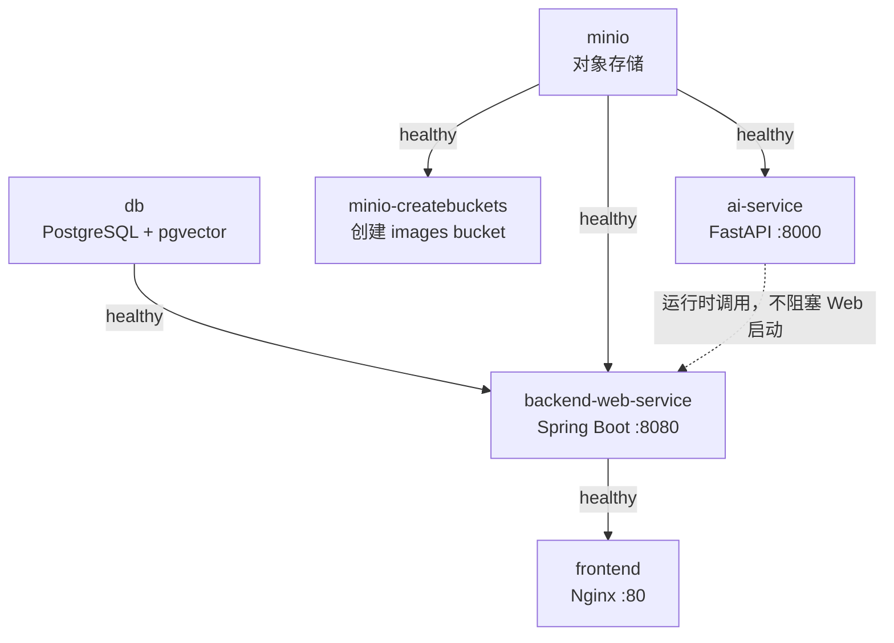
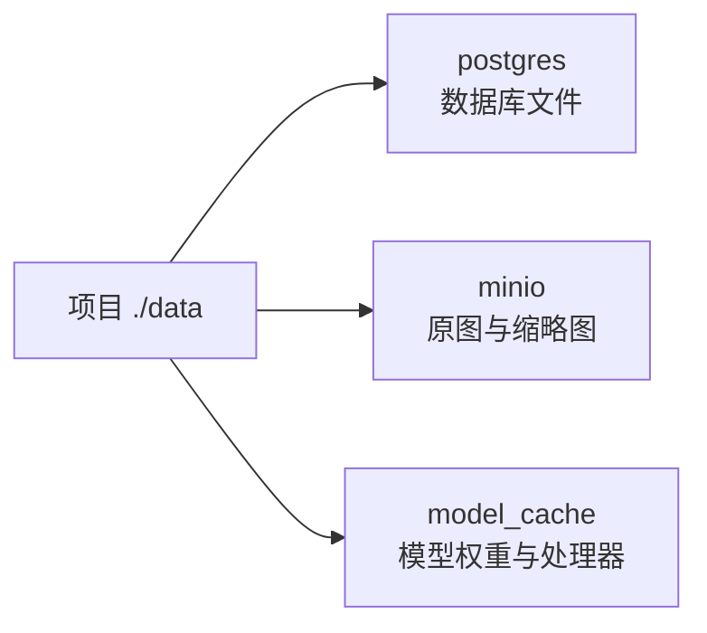

# 部署指南

根目录 `docker-compose.yml` 编排 6 个服务，其中 `minio-createbuckets` 是一次性初始化任务。默认部署面向带 NVIDIA GPU 的本机环境，业务数据与模型缓存都挂载到 `./data`。

## 服务拓扑与启动依赖


```mermaid
flowchart TD
    DB["db<br/>PostgreSQL + pgvector"]
    MinIO["minio<br/>对象存储"]
    Init["minio-createbuckets<br/>创建 images bucket"]
    AI["ai-service<br/>FastAPI :8000"]
    Web["backend-web-service<br/>Spring Boot :8080"]
    Front["frontend<br/>Nginx :80"]

    MinIO -->|"healthy"| Init
    MinIO -->|"healthy"| AI
    DB -->|"healthy"| Web
    MinIO -->|"healthy"| Web
    Web -->|"healthy"| Front
    AI -.->|"运行时调用，不阻塞 Web 启动"| Web
```

AI Service 不在 Web Service 的 Compose `depends_on` 中。模型下载或加载期间，前端与 Web Service 可以启动，普通图库操作仍可使用。

> 从 Redis 上传队列版本升级时，旧队列中的待处理/失败任务不会迁移：这些任务引用旧 Web 进程的本地临时文件，无法可靠恢复，请在升级后重新上传。已完成入库的图片不受影响。确认升级正常后，可自行归档或删除不再使用的 `data/redis`。

## 快速启动

```bash
cp .env.example .env
# 编辑 .env 并设置本地凭据
docker compose up -d --build
docker compose ps
```

访问入口：

| 地址 | 用途 |
| --- | --- |
| `http://localhost` | BaKaBooru 前端 |
| `http://localhost:9001` | MinIO 管理控制台 |
| `http://localhost:9000` | MinIO S3 API（默认对宿主机暴露） |

PostgreSQL、Web 与 AI 服务没有映射到宿主机端口，通过 Compose 网络互访。首次启动时 Flyway 会执行数据库迁移（包括标签字典与持久化任务表），AI Service 会下载模型；耗时取决于网络、磁盘和 GPU 环境。AI Service 不需要数据库账号。

## 数据卷


```mermaid
flowchart LR
    Data["项目 ./data"] --> PG["postgres<br/>数据库文件"]
    Data --> M["minio<br/>原图与缩略图"]
    Data --> C["model_cache<br/>模型权重与处理器"]
```

升级或重建容器不会自动删除这些目录。备份时至少应成对保留 PostgreSQL 与 MinIO 数据，避免元数据和对象内容失配。

## 配置分层

### 本地 `.env`

Compose 启动前必须存在 `.env`。可复制 `.env.example` 后填写；`.env` 已被 Git 忽略。

| 变量 | 说明 |
| --- | --- |
| `POSTGRES_USER` | PostgreSQL 管理及应用账号 |
| `POSTGRES_PASSWORD` | PostgreSQL 密码 |
| `POSTGRES_DB` | 应用数据库名 |
| `MINIO_ROOT_USER` | MinIO root 账号；当前同时供应用使用 |
| `MINIO_ROOT_PASSWORD` | MinIO root 密码 |
| `POSTGRES_EXPORTER_PASSWORD` | PostgreSQL Exporter 专用账号密码 |

Compose 使用必填变量表达式，缺少任何上述配置时会在创建容器前失败。不要提交包含真实凭据的 `.env`。

### 应用默认配置

Compose 内部默认使用 `db:5432/bakabooru`、`minio:9000/images` 和 `http://ai-service:8000`。模型缓存目录固定为 `/model_cache`，缩略图规格固定为 `1024 / 0.85 / jpg`。Worker 轮询、心跳、锁租期和清理 cron 属于启动配置，不在系统设置页动态修改。

AI Service 的 `DEVICE` 未设置时默认为 `auto`，自动选择 CUDA 或 CPU。需要接入 Compose 外部服务时，可按 `application.yml` 中对应的变量名覆盖非敏感地址。

### 运行时设置

以下配置保存在 PostgreSQL，可在系统设置页修改，并作用于保存后的新任务或下一次清理：

| 设置 | 默认值 | 范围 |
| --- | --- | --- |
| 标签阈值 | `0.61` | `0.0-1.0` |
| AI 最大尝试次数 | `5` | `1-20` |
| AI 重试初始延迟 | `30` 秒 | `1-3600` 秒 |
| AI 重试最大延迟 | `1800` 秒 | `1-86400` 秒，且不小于初始延迟 |
| 已完成上传任务保留期 | `7` 天 | `1-365` 天 |

认证密码、初始化标记和基础设施凭据不通过通用设置 API 返回或修改。当前 MinIO bucket 被初始化为匿名可读，以支持 `/oss/*` 图片展示；若要改为私有 bucket，需要同时改造 URL 签名/代理策略。

## 配置变更影响

- 修改 `.env` 中的凭据后，需要同步依赖服务并重启容器；已有 PostgreSQL 或 MinIO 数据目录不会自动接受新的初始化凭据。
- 修改运行时 AI 重试参数不会重写已完成或已失败任务，只影响后续失败判断和重试时间计算。
- 更改模型缓存目录时应保留卷挂载，否则每次重建都可能重新下载模型。
- CPU-only 环境需移除或调整 `gpus: all`，并确认所安装的 ONNX Runtime 与目标环境兼容。
