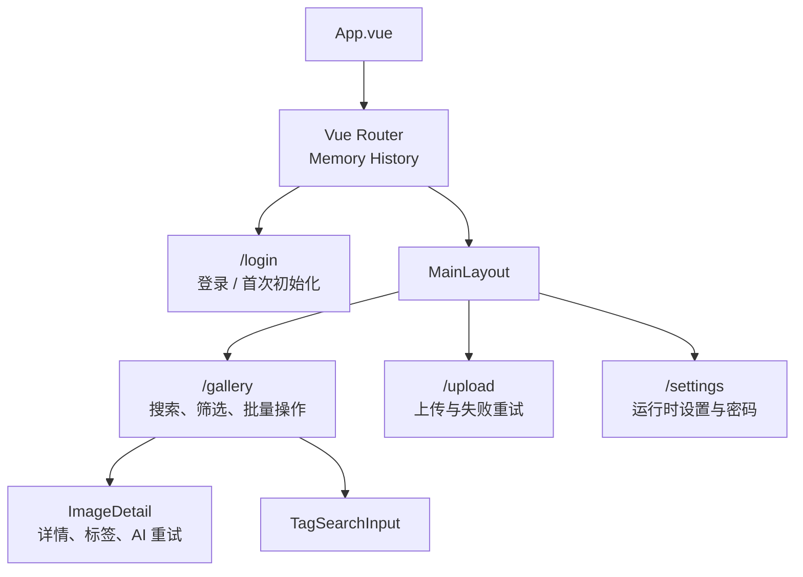
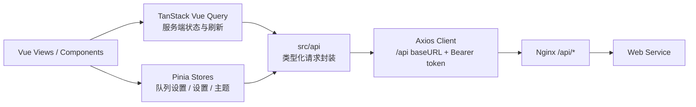
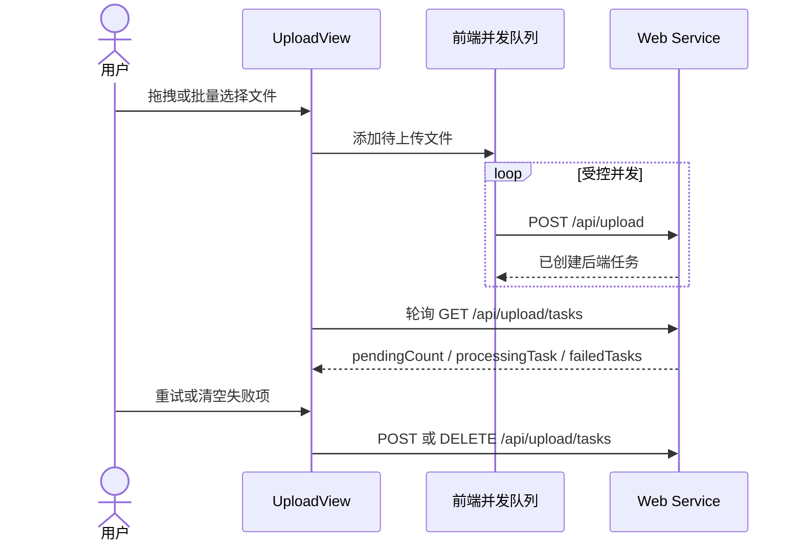

# 前端

前端位于 `frontend`，使用 Vue 3、TypeScript、Vite、Naive UI、Pinia 和 TanStack Vue Query。生产镜像由 Node 构建静态资源，再交给 Nginx 提供页面和反向代理。

## 页面与路由



项目当前使用 `createMemoryHistory()`，地址栏不会形成传统 history 路径；Nginx 仍配置了 SPA fallback，便于静态入口统一返回 `index.html`。

## 数据访问



| API 文件 | 对应能力 |
| --- | --- |
| `api/auth.ts` | 初始化状态、登录、设置/修改密码 |
| `api/search.ts` | 条件/语义搜索、以图搜图 |
| `api/gallery.ts` | 图片详情、标签、AI 重试、批量操作 |
| `api/upload.ts` | 文件上传、任务轮询、失败重试与清理 |
| `api/system.ts` | 运行时设置 |
| `api/tags.ts` | 标签联想查询 |

## 搜索与分页

搜索请求可组合标签、关键字、语义描述、AI 状态、宽高、文件大小、排序与随机种子。响应统一为：

```ts
interface SearchResult<T> {
  content: T[]
  page: number
  size: number
  hasNext: boolean
}
```

前端只呈现上一页/下一页，不依赖精确总数。图库卡片优先加载 `thumbnailUrl`；缩略图尚未 backfill 或返回 404 时，图片元素回退到 `imageUrl`。

## 上传交互



浏览器端上传完成只表示后端已接收临时文件并创建任务，不表示对象归档或 AI 处理已经完成。页面通过任务轮询展示后端入库阶段的进度。

## AI 状态展示

- `PENDING`：等待处理；若详情中存在 `aiError`，可手动重试。
- `PROCESSING`：Web Service 已调度推理。
- `READY`：标签与图像向量已经持久化。

图库侧栏可以按状态过滤，并可触发“处理所有待处理图片”；该操作只会入队没有遗留错误的 `PENDING` 图片。

## 开发命令

```bash
cd frontend
pnpm install
pnpm dev
```

常用校验：`pnpm build` 会先运行 `vue-tsc -b`，再执行 Vite 生产构建。
