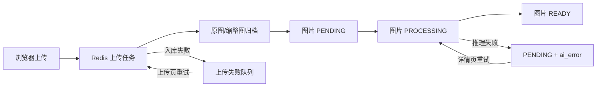
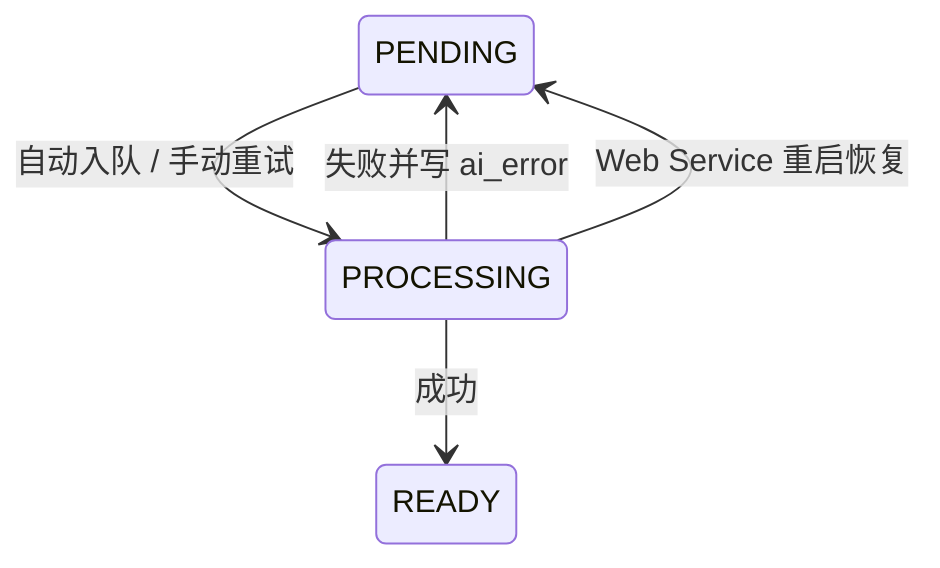
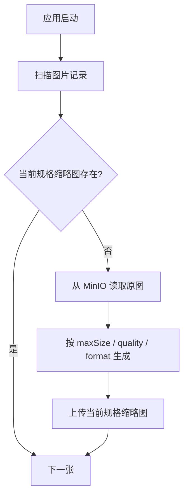
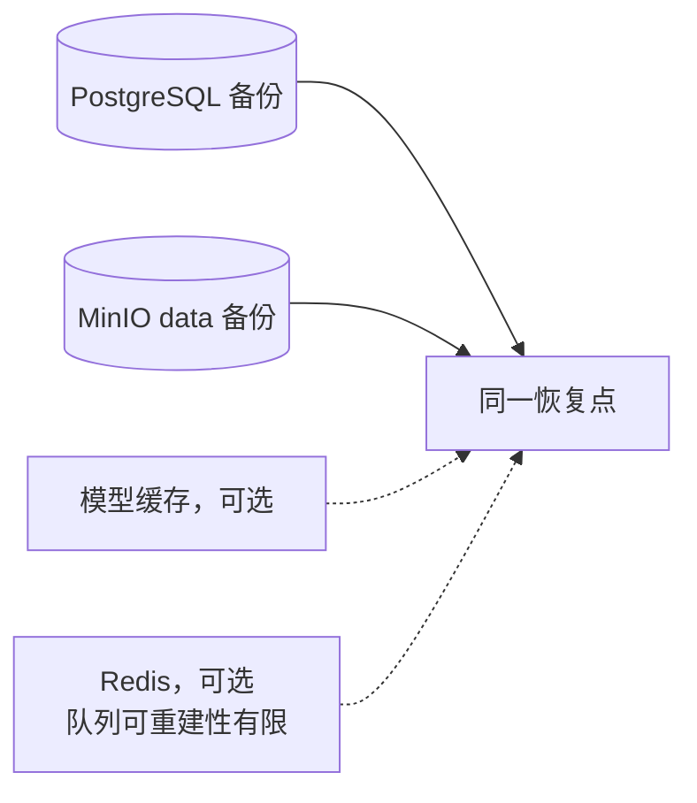

# 运维手册

本页按“先判断阶段，再处理失败”的方式组织。上传入库与 AI 后处理是两个独立阶段，排障时不要把 Redis 上传失败队列和图片 `ai_status` 混为一谈。

## 运行状态总览



## 日常检查

```bash
docker compose ps
docker compose logs --tail 200 backend-web-service
docker compose logs --tail 200 backend-ai-service
```

重点观察：

| 组件 | 健康/异常信号 |
| --- | --- |
| Web Service | `/actuator/health`、数据库迁移、Redis/MinIO 连接、AI 处理日志 |
| AI Service | `/health` 的 `loading/ok`、模型下载、CUDA Provider、推理异常 |
| PostgreSQL | `pg_isready`、Flyway migration、磁盘空间 |
| MinIO | bucket 是否存在、`original/` 与 `thumbnail/` 对象、磁盘空间 |
| Redis | 上传队列堆积、失败任务、设置缓存 |

Compose 的 AI 健康检查只要求 `/health` 可访问。判断模型是否真正就绪时，应查看响应体是否为 `{"status":"ok"}` 或检查 AI Service 日志中的“所有模型预加载完成”。

## AI 状态与恢复



| 状态 | 解释 | 建议操作 |
| --- | --- | --- |
| `PENDING` 且无错误 | 等待调度 | 等待启动扫描，或使用“处理所有待处理图片” |
| `PENDING` 且有错误 | 上次 AI 处理失败 | 修复根因后在详情页单图重试 |
| `PROCESSING` | 已提交到进程内线程池 | 观察 Web/AI 日志；重启后会恢复为待处理 |
| `READY` | 标签和图像向量已写入 | 可参与完整的向量检索 |

自动恢复策略：Web Service 启动时先把遗留 `PROCESSING` 改回 `PENDING`，再调度所有没有 `ai_error` 的待处理图片。保留错误的记录不会被无限自动重试。

## 上传任务恢复

上传页展示三个指标：Redis 待处理数、当前 Web 进程正在处理的任务、失败任务列表。

- 单个失败任务可重新推回待处理队列。
- 清空失败任务会删除对应 Redis 数据，并尝试删除遗留临时文件。
- 任务数据默认 3 天过期；如果数据已过期但 ID 仍在队列中，消费者会跳过该任务。
- Web Service 当前使用单线程做文件入库，大文件缩略图生成可能让队列短时堆积，这是预期行为。

## 缩略图 Backfill

Web Service 启动后在后台检查当前配置路径的缩略图，缺失时从原图补生成。此过程不阻塞搜索。



修改 `THUMBNAIL_MAX_SIZE` 或 `THUMBNAIL_FORMAT` 后会形成新的对象前缀。旧规格不会自动清理；确认新规格全部补齐并完成备份后，再制定单独的对象清理方案。

## 常见故障

### 图片列表存在，但缩略图 404

1. 前端会自动回退到原图，因此通常不影响浏览。
2. 查看 Web Service 的 backfill 日志。
3. 检查 `original/{hash}` 是否存在、MinIO 凭据是否一致、bucket 是否可读。
4. 确认 Nginx `/oss/*` 代理与 MinIO bucket 路径匹配。

### AI 长时间处于 `PENDING`

1. 打开图片详情查看 `aiError`。
2. 检查 AI `/health` 是否已从 `loading` 变为 `ok`。
3. 检查模型缓存下载、CUDA/CPU Provider 和 MinIO 原图读取。
4. 修复后单图重试；无错误的批量积压可使用批量入队。

### 语义搜索或以图搜图结果少

- 只有 `embedding IS NOT NULL` 的图片参与向量排序。
- 用 `READY` 状态过滤确认已完成处理的数据量。
- 检查 AI Service 文本/视觉 CLIP 模型是否来自同一模型版本。
- 以图搜图还受请求中的相似度阈值影响，可在确认需求后适当降低。

### 普通搜索可用，但语义搜索失败

这通常说明 Web Service 与数据库正常，而 AI Service 尚未就绪或内部 URL 不通。检查 `AI_SERVICE_URL`、Compose 网络、模型状态和 AI 日志；无需先重启 PostgreSQL 或 MinIO。

## 备份建议



图片元数据与对象文件必须尽量采用同一恢复点。模型缓存可重新下载；Redis 包含未完成上传任务和缓存，不应替代 PostgreSQL 备份。
